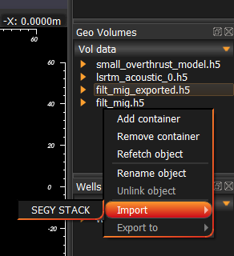

Data reader
===========

Import/Export geological data are done through pop-up menu in `Data trees`. 
Right click on `Data tree` will cause pop-up menu to appear. 

For example geo-volume reader look like shown in the picture below:

.. image:: geovolume_reader.png
   :scale: 50 %
   :alt: geo-volume reader picture
   :align: center

Most of the options should be well known. 
To set a spatial reference select row from lower table and using drag&drop put it to the correct row in the upper table. 
This will automatically set CRS for the selected object.

..  note::
   Colada uses RHS coordinate system. That means Z axis decreases downwards. 
   Be careful when selecting positive or negative sampling rate for seismic. 
   In the same time geo-volume can only have positive spacings.