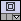

# Wave Modeling

Before starting to work with wave modeling/migration/inversion we must have at least two things:
1) velocity model
2) geometry

Velocity model is a Geo Volume object.
It may be read from SEGY or be prepared using Python/Julia interface.

Geometry is either *H5Seis* object or SEGY files.
It includes at least Source/Receiver positions (XYZ coordinates).
Geometry may be generated using *Seismic* module under *Geometry* section.
It is pretty straightforward.

In this tutorial we will use Python interface to build model and generate geometry.

## 2D velocity model building

Let's start from setting initial data to build model with two horizontal layers:

```python
from h5geopy import h5geo
import numpy as np
import scipy as sp
import scipy.ndimage
import colada
import os

# to be able to open hdf5 container in HDFVIEW
os.environ["HDF5_USE_FILE_LOCKING"] = "FALSE"

# setting output directories
out_vol_dir = colada.Util().defaultGeoVolumesDir() +'/'
out_seis_dir = colada.Util().defaultSeisDir() +'/'
out_volcnt_name = "model_2D.h5"
out_vol_name = "model_2D"
out_vol_name_smooth = "model_2D_smooth"
out_geomcnt_name = "geom_2D.h5"
out_geom_name = "geom_2D"

SPATIAL_REFERENCE = h5geo.sr.getAuthName() + ":" + h5geo.sr.getAuthCode()
LENGTH_UNITS = "m"
TEMPORAL_UNITS = "ms"
ANGULAR_UNITS = "degree"
DATA_UNITS = "km/s"
ORIENTATION = 0.0

# model params (x,z)
o = (0,0)
d = (12.5,12.5)
n = (1000,100)
n1 = int(round(n[1]/2)) # first reflector depth

# velocities for the first and second layers
v1 = 1.5
v2 = 3

# is used to smooth velocity model
smooth_radius = 20
```
Most of this should be pretty understandable
The most important here is model parameters like size `n` of the model, origin `o`, spacings `d`.
`v1` and `v2` define first layer and second layed velocities respectively.
`smooth_radius` defines the number of points per axis to apply filter to the model to get smoothed velocity model.

Second step is to create velocity model represented by `numpy` array. 
In our case the model is very simple:

```python
x = np.arange(o[0],o[0]+d[0]*(n[0]-1),d[0])
z = np.arange(o[1],o[1]+d[1]*(n[1]-1),d[1])

data = np.zeros(n[::-1]) # reverse `n` so the `data.shape = [nz,nx]`
data[:n1,:] = v1
data[n1:,:] = v2
data_smooth = sp.ndimage.uniform_filter(data, smooth_radius)

# flip Z axis as h5geo stores volumes in low-to-high direction (origin is lower left corner)
# also make the order layout to Fortran (h5geo works with column oriented arrays)
data = np.asfortranarray(np.flip(data,0), dtype=np.float32)
data_smooth = np.asfortranarray(np.flip(data_smooth,0), dtype=np.float32)
```

Here the most important is to understand which direction correspond to wich axis.
If we work with 2D model then numpy array should be of shape `[nz,nx]`.
`data` is our model (`numpy` array).
`data_smooth` is smoothed model.
Here is the trick: Colada uses origin as lower left corner of the model. Thus we need to flip `z` axis.

Also it worth to notice that `h5geo` works only with `1D` and `2D` Fortran memory ordered arrays and the writable data usually stored as `float32`.

:::{note}

Pay attension that we will alway use Fortran memory layout when working with `h5geo`. 
And don't forget to cast data to 1D or 2D array of `float32`.

:::

The last step is to create `H5Seis` object within seismic container and write the generated model:
```python
p = h5geo.H5VolParam()
p.spatialReference = SPATIAL_REFERENCE
p.lengthUnits = LENGTH_UNITS
p.temporalUnits = TEMPORAL_UNITS
p.angularUnits = ANGULAR_UNITS
p.dataUnits = DATA_UNITS
p.domain = h5geo.Domain.TVDSS
p.orientation = ORIENTATION
p.X0 = o[0]
p.Y0 = 0.0
p.Z0 = o[1]-d[1]*(n[1]-1)
p.dX = d[0]
p.dY = 1.0
p.dZ = d[1]
p.nX = n[0]
p.nY = 1
p.nZ = n[1]
p.xChunkSize = 64
p.yChunkSize = 1
p.zChunkSize = 64
p.compression_level = 6

# create Geo Volume container
volcnt = h5geo.createVolContainerByName(
      out_vol_dir+out_volcnt_name,
      h5geo.CreationType.OPEN_OR_CREATE)
if not volcnt:
  raise RuntimeError(f"Unable to create Volume container: {out_volcnt_name}")

# create Geo Volume object (H5Vol)
vol = volcnt.createVol(out_vol_name, p, h5geo.CreationType.CREATE_OR_OVERWRITE)
if not vol:
  raise RuntimeError(f"Unable to create Geo Volume: {out_vol_name}")

# write the data to Geo Volume
status = vol.writeData(data.ravel(), 0,0,0,p.nX,p.nY,p.nZ, DATA_UNITS)
if not status:
  raise RuntimeError(f"Unable to write data to Geo Volume: {out_vol_name}")

# create Geo Volume for smotthed model
volsmooth = volcnt.createVol(out_vol_name_smooth, p, h5geo.CreationType.CREATE_OR_OVERWRITE)
if not vol:
  raise RuntimeError(f"Unable to create Geo Volume: {out_vol_name_smooth}")

# write smoothed data to Geo Volume
status = volsmooth.writeData(data_smooth.ravel(), 0,0,0,p.nX,p.nY,p.nZ, DATA_UNITS)
if not status:
  raise RuntimeError(f"Unable to write data to Geo Volume: {out_vol_name_smooth}")

volcnt.getH5File().flush()
```
The variable `p` is used to create new `H5Vol` object.
Almost all its fields are self descridable.

`X0,Y0,Z0` define origin (in legth units).
`dX,dY,dZ` are spacings aling `X,Y,Z` axes respectively.
`nX,nY,nZ` are dimensions.
`orientation` is orientation around `Z` axis.

Chunking is important for IO perfomance. 
In this case we are trying to imitate `ZGY` format using chunking equal to 64.
`compression_level` is used to compress the data.

`flush()` tries to flush the data to the disk.
This makes us confident that the data is actually written.

:::{note}

Geo Volume must not contain zeroed or negative spacings (i.e. it must have `dX,dY,dZ > 0`).
Also `nX,nY,nZ` must be `> 0`.

:::

### Velocity model visualization

Now open the generated files in Colada i.e. right click on Geo Volume treeview `Add container` and add generated model. 

Load Geo Volume. 
The picture should be similar to this one:

```{image} model_2d.png
:alt: Colada velocity model 2d
:class: bg-primary
:scale: 70%
:align: center
```

## Geometry for 2D model

There is no need to write the algorithm for calculating geometry.
It is already done in `h5geo`.

So we start by setting the initial data for geometry:
```python
nSamp = 500
sampRate = -4.0
src_x0 = o[0]
src_dx = 1000
src_nx = int(np.ceil((x[-1]-x[0])/src_dx))
src_y0 = 0
src_dy = 0
src_ny = 1
src_z = o[1]

rec_x0 = o[0]
rec_dx = 100
rec_nx = int(np.ceil((x[-1]-x[0])/rec_dx))
rec_y0 = 0
rec_dy = 0
rec_ny = 1
rec_z = o[1]
moveRec = False
```

Then we simpy fill `H5SeisParam` fields to create new `H5Seis` object within seismic container and call the function `generatePRESTKGeometry` to generate PRESTACK geometry:
```python
# h5geo parameters to create new H5Seis object
p = h5geo.H5SeisParam()
p.spatialReference = SPATIAL_REFERENCE
p.lengthUnits = LENGTH_UNITS
p.temporalUnits = TEMPORAL_UNITS
p.angularUnits = ANGULAR_UNITS
p.dataUnits = "psi"
p.domain = h5geo.Domain.TWT
p.dataType = h5geo.SeisDataType.PRESTACK
p.surveyType = h5geo.SurveyType.THREE_D
p.nTrc = 100
p.nSamp = 100
p.srd = 0
p.trcChunk = 100
p.stdChunk = 100

# create Seismic container
geomcnt = h5geo.createSeisContainerByName(
      out_seis_dir + out_geomcnt_name,
      h5geo.CreationType.OPEN_OR_CREATE)
if not volcnt:
  raise RuntimeError(f"Unable to create Seis container: {out_geomcnt_name}")

# create H5Seis object
geom = geomcnt.createSeis(out_geom_name, p, h5geo.CreationType.CREATE_OR_OVERWRITE)
if not geom:
  raise RuntimeError(f"Unable to create Seis: {out_geom_name}")

# setting sampling rate
geom.setSampRate(sampRate)

# generate geometry
status = geom.generatePRESTKGeometry(
    src_x0, src_dx, src_nx,
    src_y0, src_dy, src_ny,
    src_z,
    rec_x0, rec_dx, rec_nx,
    rec_y0, rec_dy, rec_ny,
    rec_z,
    ORIENTATION,
    moveRec)

if not status:
  raise RuntimeError(f"Unable to generate geometry: {out_geom_name}")

geomcnt.getH5File().flush()
```

For every shot the receivers are spread over the whole model. 
To move receiver along with sources set `moveRec = True`.

### Geometry check

After geometry was generated load it to the Colada i.e. right click on Seismic treeview `Add container` and add the geometry. 

First thing to do is to add sorting.
As we have PRESTACK geometry then we can add `SP` sorting.
For that go to the `Seismic` module, set active seismic at the top (one may use drag&drop from treeview), open *Sorting* section and double click on `SP` header.
This will cause `SP` to appear in the right list.
Then click `Add Sorting`.

After that `SP` sorted data may be loaded either as any type of mesh or loaded to table.
We will load it to table and plot.

Open *Load to Table* section, click on combobox *Select a Table->Create new Table*.
Most widgets become enabled. In the `Sorted trace headers` section set `SP` as *primary key* (PKey). Then click on *plus* button to add secondary key (SKey) and set it to `GRPX` and click *Load sorted trace headers*.

Change layout by clicking the button on the toolbar similar to this  and choose one containing *plot*. 

Go to the *Plots* module click `Create new PlotChart`.
This simply creates new plot.
To add data to it click `Create new PlotSeries`.
Then click on `Series` tab. Set the parameters:
* Input table: *Table*
* Plot type *Scatter*
* X Axis column: *GRPX*
* Y Axis column: *SP*
* Marker style: *square*
* Line style: *None*

After some manipulations one can achieve something like that:

```{image} plot_geometry_2d.png
:alt: Colada plot geometry 2D
:class: bg-primary
:scale: 70%
:align: center
```

:::{note}

Loaded trace headers are also available in *Tables* module.
But be aware that tables with n*1000 rows work slow and may greatly reduce the perfomance.

:::